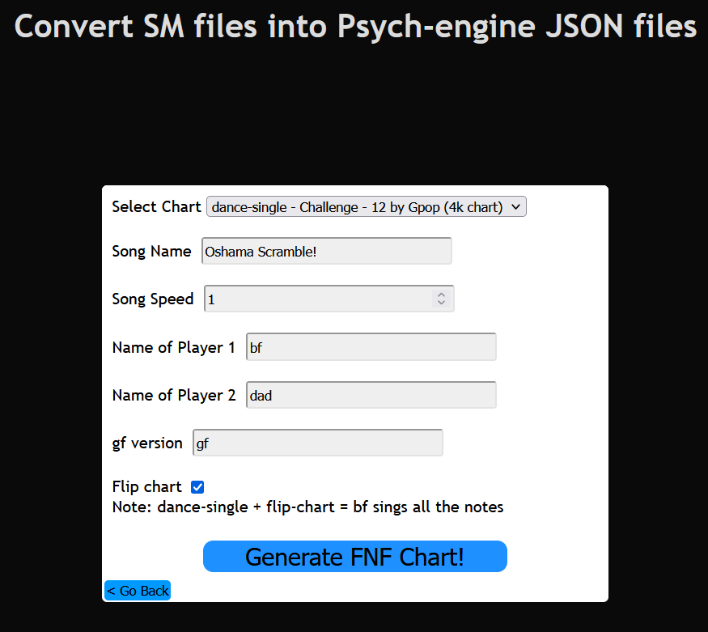

# SM to Psych-engine JSON converter

### This is a web version of my older python project which converts Stepmania/Etterna Charts (*.sm files) into FNF JSON files, which are compatible with the Psych-engine (as of v0.6.2)
#### Ported over from Python to Haxe

Check it out <a href="https://uncertainprod.github.io/smtopsychjson/index.html">here</a>.

#### Note: Does not support *.ssc files or json to sm conversion just yet

The program allows pretty much any chart in any *.sm file to be converted into Psych-engine. Just select the SM file, fill in the form and it should generate the resulting JSON file as a download.

#### Side Note: If you're converting a 4k chart instead of an 8k chart. Be sure to check the checkbox labelled "Flip chart" if you want bf (the player character) to get all the notes.

**Warning** : This program will generate charts for any game mode (dance-single, dance-double, pump-single etc) although for Stepmania game modes that do not have 4 or 8 keys, the resulting json chart may not work as intended, so best stick to dance-single (only bf/opponent gets notes) or dance-double (for both bf and the opponent) charts alone. Currently does not support negBPM charts (They seem to get de-synced) but can handle bpm changes for the most part.